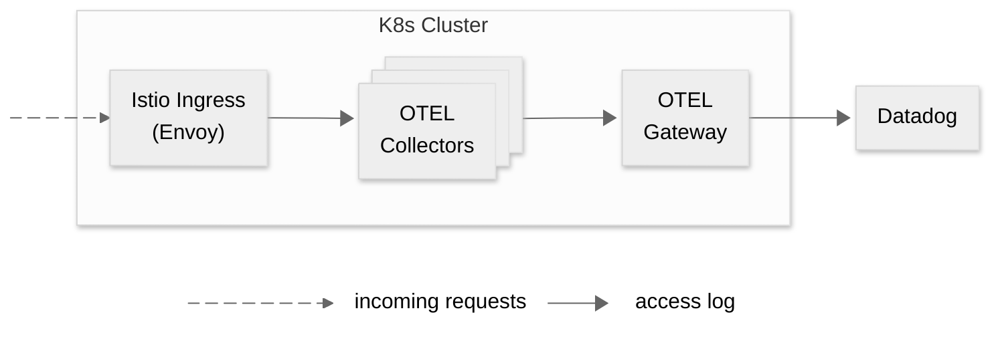

Today is not about documenting the current shortcomings of [AI coding](https://latest.stefan.fail/tag/ai-coding/). Instead, I'm going to document that I'm just as capable as AI when it comes to making dumb mistakes[^1]

This post shows how to ship Envoy access logs to Datadog via OpenTelemetry (OTEL) from an Istio-enabled Kubernetes cluster. Or, visually:



Seems easy enough, so let's get started.

## Envoy: Let There Be Access Logs

Istio uses Envoy under the hood for networking. We need the right incantation to inform Istio that we need Envoy's access logs and how to format them. First, `meshConfig` needs to be configured with an `envoyOtelAls` [extension provider](https://istio.io/latest/docs/reference/config/istio.mesh.v1alpha1/#MeshConfig-ExtensionProvider). The `logFormat.labels` property can be used to [propagate access logs properties such as response code and others as OTEL annotations](https://istio.io/latest/docs/tasks/observability/telemetry/). We'll later use those in our OTEL pipelines.

Using the Istio Operator, the config can look like:
```yaml
# fields omitted for brevity
apiVersion: install.istio.io/v1alpha1
kind: IstioOperator
spec:
  # ...
  meshConfig:
    enableTracing: true
    extensionProviders:
    - name: otel
      envoyOtelAls:
        service: ingest-collector.opentelemetry.svc.cluster.local
        port: 4317
        logFormat:
          labels:
            log_name: "otel_envoy_accesslog" 
            http.method: "%REQ(:METHOD)%"
            http.path: "%REQ(X-ENVOY-ORIGINAL-PATH?:PATH)%"
            http.protocol: "%PROTOCOL%"
            http.status_code: "%RESPONSE_CODE%"
            http.status_flags: "%RESPONSE_FLAGS%"
            route_name: "%ROUTE_NAME%"
            # ...
  # ...
```

Next, Istio's [Telemetry API](https://istio.io/latest/docs/tasks/observability/telemetry/) can be used to fine-tune access logs and other telemetry data within our infrastructure. To enable shipping of only access logs at the ingress gateway, define the following Telemetry resource:

```yaml
# fields omitted for brevity
apiVersion: telemetry.istio.io/v1alpha1
kind: Telemetry
metadata:
  name: istio-ingress-accesslogs
  namespace: istio-system
spec:
  selector:
    matchLabels:
      # apply to the ingress gateway pod via this label
      app.kubernetes.io/name: istio-ingressgateway
  accessLogging:
    - providers:
      - name: otel  # name of our extension provider from the IstioOperator
```

## OTEL: Aggregate All The Logs!

Access logs are now flowing to the OTEL collector. Next, we will transform the logs to our liking. For example, the access logs lack a severity level (ok, technically they have one, but it's `0`). If your OTEL pipeline filters by severity, those logs may be dropped.

In the `OpenTelemetryCollector` resource snippet below we define a processor that assigns severity levels based on the request's HTTP status code: ≥ 500 → error, 400–499 → warning, else info. It also shows how we access the labels we defined earlier in the `IstioOperator` resource.

```yaml
# fields omitted for brevity
apiVersion: opentelemetry.io/v1beta1
kind: OpenTelemetryCollector
metadata:
  name: ingest-collector
  namespace: opentelemetry
spec:
  # ...
  config:
    exporters:
      # ...
    processors:
      transform/istio_accesslogs_severity:
        error_mode: ignore
        log_statements:
        - context: log
          statements:
          - 'set(severity_number, SEVERITY_NUMBER_WARN) where attributes["log_name"] == "otel_envoy_accesslog" and Int(attributes["http.status_code"]) >= 400 and Int(attributes["http.status_code"]) < 500'
          - 'set(severity_number, SEVERITY_NUMBER_ERROR) where attributes["log_name"] == "otel_envoy_accesslog" and Int(attributes["http.status_code"]) >= 500'
          - 'set(severity_number, SEVERITY_NUMBER_DEBUG) where attributes["log_name"] == "otel_envoy_accesslog" and (attributes["http.status_code"] == nil or Int(attributes["http.status_code"]) < 400)'
      # ...
    receivers:
      # ...
    service:
      pipelines:
        logs:
          receivers:
          - otlp
          exporters:
          - debug
          - <OTEL sink>
          processors:
          - transform/istio_accesslogs_severity
        # ...
```

Now the access logs are forwarded to the OTEL sink (OTEL Gateway/Datadog) in a standard way.

## Debugging
Wiring everything up can be difficult, especially in environments with existing, complex OTEL configuration beyond the access logs. So here are a few techniques to verify data is flowing along the way.

1. Configure the istio-proxy to directly (outside of OTEL) write access logs ([ref](https://istio.io/latest/docs/tasks/observability/logs/access-log/#using-telemetry-api))
2. Verify the proxy config is synced through the mesh using `istioctl proxy-status <your target>`
3. Verify the extension provider defined in the `IstioOperator` resource is visible to the proxy
   -  `istioctl proxy-config all <your target> -o json` 
4. Enable the [debug exporter](https://github.com/open-telemetry/opentelemetry-collector/blob/main/exporter/debugexporter/README.md) in the OTEL pipeline to dump the access logs into the collector's logs

## Bonus: Log JWT Access Token Claims
While tweaking the labels of the access logs I learned that there's a neat little trick to easily log JWT claims. Istio's `RequestAuthentication` resource offers a `outputClaimToHeaders` property that copies a selected claim into an HTTP header. The header can be added as an OTEL label (see first step).

```yaml
# fields omitted for brevity
apiVersion: security.istio.io/v1beta1
kind: RequestAuthentication
metadata:
  name: foo-req
spec:
  selector:
    matchLabels:
      istio: ingressgateway
  jwtRules:
    - issuer: <issuer>
      audiences:
      - <audience>
      outputClaimToHeaders:
      - header: x-sub-claim
        claim: sub
  # ...
```

> [!CAUTION]
> The [library envoy uses](https://github.com/envoyproxy/envoy/issues/33603) to parse the claims interprets [dots as _nested_ claims](https://github.com/google/jwt_verify_lib/issues/104). The library was archived on July 16 2025. So don't hold your breath for this feature to land soon. Instead use Envoy's Lua or WASM scripting.

---

[^1]: OK, a bit of complaining: Using [Cursor](https://latest.stefan.fail/tag/cursor-ai/) for envoy/istio/otel related tasks turned out to be the perfect breeding ground for hallucinations. 
